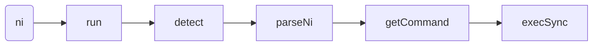

# Welcome to Ni

Presentation Ni for CondorHero

<div class="pt-12">
  <span @click="$slidev.nav.next" class="px-2 py-1 rounded cursor-pointer" hover="bg-white bg-opacity-10">
    Press Space for next page <carbon:arrow-right class="inline"/>
  </span>
</div>

<div class="abs-br m-6 flex gap-2">
  <button @click="$slidev.nav.openInEditor()" title="Open in Editor" class="text-xl icon-btn opacity-50 !border-none !hover:text-white">
    <carbon:edit />
  </button>
  <a href="https://github.com/slidevjs/slidev" target="_blank" alt="GitHub"
    class="text-xl icon-btn opacity-50 !border-none !hover:text-white">
    <carbon-logo-github />
  </a>
</div>

<!--
The last comment block of each slide will be treated as slide notes. It will be visible and editable in Presenter Mode along with the slide. [Read more in the docs](https://sli.dev/guide/syntax.html#notes)
-->

---
layout: two-cols
preload: false
---

<template v-slot:default>

# Why use Ni?

主流的包管理器：

- npm(node.js) - [npmjs.com](https://npmjs.com)
- yarn(曾经的王者) - [yarn.dev](https://yarnpkg.com)
- pnpm(最流行) - [pnpm.io](https://pnpm.io)

稍微不注意可能会引发如下血案：

> ~~npm i in a yarn project, again? F**k!~~

还有一种情况，你比较熟悉 npm，如果你想给一个 yarn 项目提 PR，可能就会需要查询下文档。

> Ni 要做的事，**缝合不同包管理器使用差异。**

</template>
<template v-slot:right>
  
</template>

<!--
如果广泛参与开源项目，往往就会面临一个问题，不同的仓库作者使用的包管理器是不同的。
-->
---

# Use Ni（I）

```zsh
# 需要全局安装。
npm i -g @antfu/ni
# 如果全局安装遭遇冲突，我们可以加上 --force(-f) 参数强制安装。
```

### ni - install

<div grid="~ cols-3 gap-3 row-start-auto">

```zsh {1}
ni

# npm install
# yarn install
# pnpm install

```

```zsh {1}
ni axios

# npm i axios
# yarn add axios
# pnpm add axios

```

```zsh {1}
ni @types/node -D

# npm i @types/node -D
# yarn add @types/node -D
# pnpm add -D @types/node

```

```zsh {1}
ni -g iroiro

# npm i -g iroiro
# yarn global add iroiro
# pnpm add -g iroiro

# this uses default agent, regardless your current working directory

```

```zsh {1}
ni --frozen

# npm ci
# yarn install --frozen-lockfile
# pnpm install --frozen-lockfile
```

<p>
nci - clean install

```zsh {1}
nci

# npm ci
# yarn install --frozen-lockfile
# pnpm install --frozen-lockfile
```
</p>

</div>

---
layout: two-cols
---

<template v-slot:default>

# nci / ni --frozen 

```zsh
npm ci
yarn install --frozen-lockfile
pnpm install --frozen-lockfile
```

### npm ci & npm install

npm ci 的好处：

1. 无侵入式安装依赖（不会更新 package.json 和 package-lock.json）。
2. [npm ci 比 npm install 快两倍](https://blog.npmjs.org/post/171556855892/introducing-npm-ci-for-faster-more-reliable.html)，原因就是少了依赖解析。

但是有时候又会很慢，[Node package manager benchmark](https://github.com/zkat/node-package-manager-benchmark/tree/zkat/cipm) 原因就在需要删除 node_modules 文件夹需要时间。

</template>
<template v-slot:right>
  
</template>

<style>
h1 {
  background-color: #2B90B6;
  background-image: linear-gradient(45deg, #4EC5D4 10%, #146b8c 20%);
  background-size: 100%;
  -webkit-background-clip: text;
  -moz-background-clip: text;
  -webkit-text-fill-color: transparent;
  -moz-text-fill-color: transparent;
}
</style>

---

# Use Ni（II）

### nun - uninstall

<div grid="~ cols-3 gap-3">

```zsh {1}
nun axios

# npm uninstall axios
# yarn remove axios
# pnpm remove axios
```

```zsh {1}
nun @types/node -D

# npm uninstall @types/node -D
# yarn remove @types/node -D
# pnpm remove -D @types/node
```

```zsh {1}
nun -g eslint

# npm uninstall -g eslint
# yarn global remove eslint
# pnpm remove -g eslint
```

</div>

### nr - run

<div grid="~ cols-3 gap-3">

```zsh {1}
nr dev --port=3000

# npm run dev -- --port=3000
# yarn run dev --port=3000
# pnpm run dev -- --port=3000
```

```zsh {1}
nr

# interactively select the script to run
# supports https://www.npmjs.com/package/npm-scripts-info convention
```

```zsh {1}
nr -

# rerun the last command
```

</div>


<div flex="~ gap-4">

<aside style="flex-grow: 2;">

### nx - execute

```zsh {1}
nx jest

# npx jest
# yarn dlx jest
# pnpm dlx jest
```

</aside>


<main flex="~ col" style="flex-grow: 1.5;">

### nu - upgrade

<div  grid="~ cols-2 gap-2" >


```zsh {1}
nu

# npm upgrade
# yarn upgrade
# pnpm update
```

```zsh {1}
nu -i

# (not available for npm)
# yarn upgrade-interactive
# pnpm update -i
```
</div>
</main>
<aside style="flex-grow: 2;">

### na - agent alias

```zsh {1}
na

# npm
# yarn
# pnpm
```

</aside>
</div>

---

# 注册命令

> 演示代码是 [Ni](https://github.com/antfu/ni/commit/54c680ad4fdc1f3978fa4678c3f90d5da037864b) 的第一个 commit，因为它足够简单，后面复杂的代码也能看懂。

Package 可执行文件，Node.js 默认支持三个命令，npm、node、npx 位置存放于：


还有一些命令使我们自己安装的，比如 `npm i -g eslint`，我们就可以使用 eslint 这个全局命令。如果在项目安装依赖，那么 npm 就会将命令放置在 `node_modules/.bin` 目录下， npm 怎么注册一个命令呢，答案在 `package.json` 的 [bin](https://docs.npmjs.com/cli/v7/configuring-npm/package-json#bin) 字段，我们有两种方式来注册命令：

<div grid="~ cols-2 gap-3">

```json
// CJS 方式，js 文件使用 require()
{
  "bin": {
    "ni": "bin/ni.js",
    "nr": "bin/nr.js"
  }
}
```

```json
// ESM 方式，mjs 文件使用 import 导入
{
  "bin": {
    "ni": "bin/ni.mjs",
    "nci": "bin/nci.mjs"
  }
}

```

</div>

---

# 检测项目包管理器 （run => detect）

前面通过 bin 来注册一个 ni 命令，现在假设我们在控制台运行 `ni axios -D` 命令，代码走的流程如下：

<div grid="~ cols-2 gap-3 gap-y-1">

<section>

1. 来到 `ni.ts` 文件，运行 run 函数:

```js {4-6}
import { parseNi } from './commands'
import { run } from './runner'

// 先不看 run 里面的这个回调，就简单的认为执行 ni 命令，然后调用 run 函数：
run(async(agent, args) => {
  return parseNi(agent, args)
})
```

</section>

<section>

2. run 函数调用 detect 函数确定项目的包管理器：

```js {3}
export async function run(fn) {
  // 检测项目包使用了什么包管理器，例如 pnpm
  const agent = await detect()
  // 先不看下面
  const args = process.argv.slice(2).filter(Boolean)
  const command = await fn(agent, args)
  execSync(command, { stdio: 'inherit' })
}
```
</section>

<section>

3. 两个关键变量
```js
export const DEFAULT_AGENT = 'npm'
export const LOCKS = {
  'pnpm-lock.yaml': 'pnpm',
  'yarn.lock': 'yarn',
  'package-lock.json': 'npm',
}
```
</section>

<section>

4. 重点来了：

```js
export async function detect() {
  // 根据 lockfiles 检查项目支持的包管理器。
  const result = await findUp(Object.keys(LOCKS))
  // 如果没有找到，默认使用 npm 
  if (!result)
    return DEFAULT_AGENT
  // 如果找到了，返回对应包管理器名称
  return LOCKS[path.basename(result)] || DEFAULT_AGENT
}
```
</section>


</div>

---

# 获取输入命令的参数 (process.argv)

比如输入 `ni axios -D` 其中 `-D` 和 `axios` 是参数，那么 `args` 就是 `['axios', '-D']`。

`process.argv` 属性返回一个数组，由命令行执行脚本时的各个参数组成。它的第一个成员总是 node.js 的安装路径，第二个成员是脚本的文件名，其余成员是脚本文件的参数。

```js
const args = process.argv.slice(2).filter(Boolean)
```

<div grid="~ cols-2 gap-3 gap-y-1">

<section v-click>

1. 假设有一 TS 文件内容为：

```js
console.log('full argv: ', process.argv)
console.log('input argv: ', process.argv.slice(2).filter(Boolean))
```
</section>

<section v-click>

2. 使用此命令运行：

```js {2}
"scripts": {
    "run": "esno demo.ts axios -D"
  }
```
</section>

</div>

<section v-click>

3. 输出结果如下：

```zsh
> esno demo.ts axios -D

full argv:  [
  '/Users/tom/.nvm/versions/node/v16.15.1/bin/node',
  '/Users/tom/Desktop/ni/demo.ts',
  'axios',
  '-D'
]
input argv:  [ 'axios', '-D' ]
```

</section>

---

# 不同 install 的方式（parseNi）

<div grid="~ cols-2 gap-3 gap-y-1">

<section>

install 的命令比较复杂，比如下面这几种情况：

```zsh
npm ci
npm install
npm install -D axios
npm install axios
npm install -g axios
```

parseNi 函数就是用来处理这种情况的。

<v-clicks at="5">

<div class="px-4 py-1 border border-purple-200 rounded">

我们前面输入的命令是 `ni install -D axios`，假设项目的 lockfiles 是 `pnpm-lock.yaml`，那么它的包管理器是 pnpm。

`getCommand(agent, command, args)` 函数真正调用的是 `getCommand("pnpm", "add", ["-D", "axios"])`。

</div>
</v-clicks>

</section>

<section>

parseNi 函数的定义如下：

```js {all|2|16-20|all}
export function parseNi(agent, _args) {
  let command = 'install'
  let args = []
  if (_args.length === 0) {
    command = 'install'
    args = []
  }
  else if (_args.includes('-g')) {
    command = 'global'
    args = exclude(_args, '-g')
  }
  else if (_args.includes('--ci')) {
    command = 'frozen'
    args = exclude(_args, '--ci')
  }
  else {
    command = 'add'
    args = _args
  }
  return getCommand(agent, command, args)
}
```

</section>

</div>

<arrow v-click x1="610" y1="500" x2="470" y2="450" color="#987" width="3" arrowSize="1" />
---


# 生成可执行的命令（getCommand）

<div grid="~ cols-2 gap-3 gap-y-1">

<section v-if="$slidev.nav.clicks !== 4">

getCommand 函数的定义如下：

```js {all|2}
export function getCommand(agent, commnad, args) {
  const c = AGENTS[agent][commnad]

  if (typeof c === 'function')
    return c(args)

  return c.replace('{0}', args.join(' '))
}
```
</section>

<section v-else>

getCommand 函数的定义如下：

```js {all|7}
export function getCommand(agent, commnad, args) {
  const c = AGENTS[agent][commnad]

  if (typeof c === 'function')
    return c(args)

  return c.replace('{0}', args.join(' '))
}
```

<div class="mt-25 text-center px-4 py-1 border border-blue-200 rounded ">

`pnpm i -D axios`

</div>

</section>

<section>

```js {all|16|21}
export const AGENTS = {
  npm: {
    run: npmRun('npm'),
    install: 'npm i',
    frozen: 'npm ci',
    global: 'npm i -g {0}',
    add: 'npm i {0}',
  },
  yarn: {
    run: 'yarn run {0}',
    install: 'yarn install',
    frozen: 'yarn install --frozen-lockfile',
    global: 'yarn global add {0}',
    add: 'yarn add {0}',
  },
  pnpm: {
    run: npmRun('pnpm'),
    install: 'pnpm i',
    frozen: 'pnpm i --frozen-lockfile',
    global: 'pnpm i -g {0}',
    add: 'pnpm i {0}',
  },
}
```
</section>

<arrow v-click x1="280" y1="300" x2="280" y2="400" color="#918" width="3" arrowSize="1" />


</div>

---

# 执行命令（execSync）


```js {1,8}
import { execSync } from 'child_process'
export async function run(fn) {
  // 检测项目包使用了什么包管理器，例如 pnpm
  const agent = await detect()
  // 先不看下面
  const args = process.argv.slice(2).filter(Boolean)
  const command = await fn(agent, args)
  execSync(command, { stdio: 'inherit' })
}
```

<section v-click>

流程结束，重新回顾下。



</section>

---

# Node.js Corepack

> 如何使用不同的包管理器？

<br />

```zsh
corepack enable。
corepack enable npm。
```

优点：

1. 自带 Yarn 和 pnpm 减少下载时间。
2. 避免包管理器的混用。
3. 包管理版本不匹配（静默下载）。

<br />

> Note Corepack 默认与 Node.js 14.19.0 和 16.9.0 一起分发，所以保证 Node.js 版本大于等于 16.9.0。


我写了一篇文章可以参考：[Node.js Corepack](https://juejin.cn/post/7111998050184200199)。

---
preload: false
---

# 王者组合（Ni and Corepack）

<div grid="~ cols-2 gap-3">

<div v-motion :initial="{ x: -200 }" :enter="{ x: 0 }"  class="mt-25 text-center px-4 py-10 border border-blue-200 rounded ">

抹平下载不同的包管理器 [Corepack](https://nodejs.org/api/corepack.html)

</div>

<div v-motion :initial="{ x: 200 }" :enter="{ x: 0 }"  class="mt-25 text-center px-4 py-10 border border-blue-200 rounded ">

抹平不同包管理的命令差异 [Ni](https://github.com/antfu/ni)

</div>

</div>

